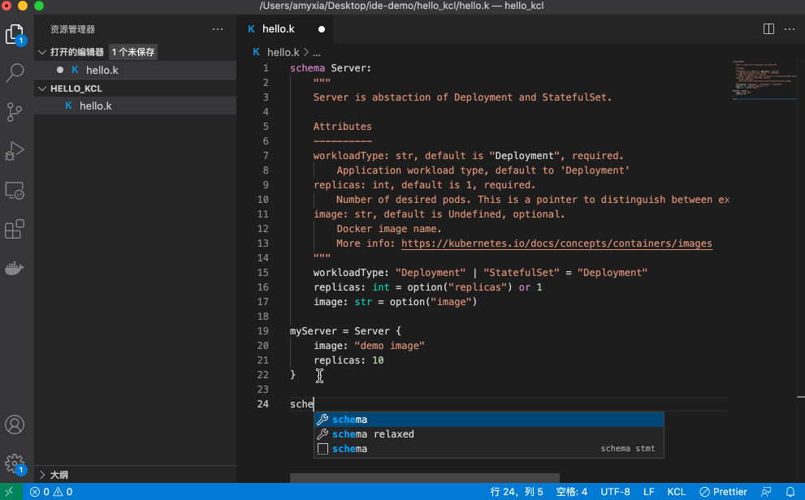

# KCL Extension for Visual Studio Code

The [VS Code KCL extension](https://marketplace.visualstudio.com/items?itemName=kcl.kcl-vscode-extension) provides rich language support for the [KCL language](https://kusionstack.io/docs/reference/lang/).

## Quick Start

Welcome to KCL developing! We hope this extension enhances your development experience with KCL.

-   **Step 1.** Install kcl on your system. We highly recommend to [install the Kusion tools package](https://kusionstack.io/docs/user_docs/getting-started/install) which contains the KCL language support and other tools. 
-   **Step 2.** Install the KCL extension for Visual Studio Code. This extension requires the VS Code 1.50+
-   **Step 3.** Open or create a KCL file and begin your KCL tour!

## Features

This extension provides coding assistance such as basic syntax highlight, IntelliSense such as auto complete and quick info hover, and code navigation. Other useful features such as diagnostics and testing are in developing.

## Ask for help

If the extension isn't working as you expect, please reach out to us by filing an issue.

## Contributing

We are working actively on improving the KCL development on VS Code. All kinds of contributions are welcomed. You can refer to our [contribution guide](docs/CONTRIBUTING.md). It introduces how to build and run the extension locally, and describes the process of sending a contribution.

## License

Apache License Version 2.0
